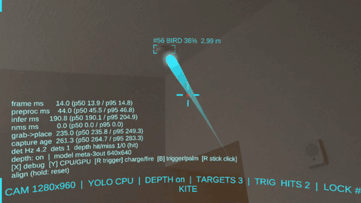
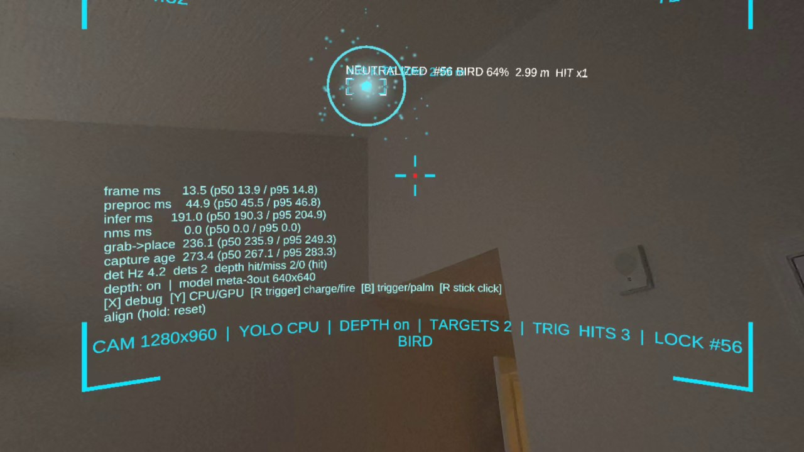
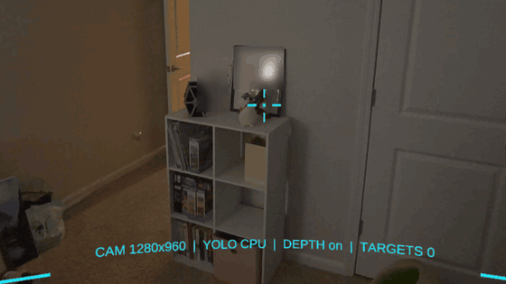
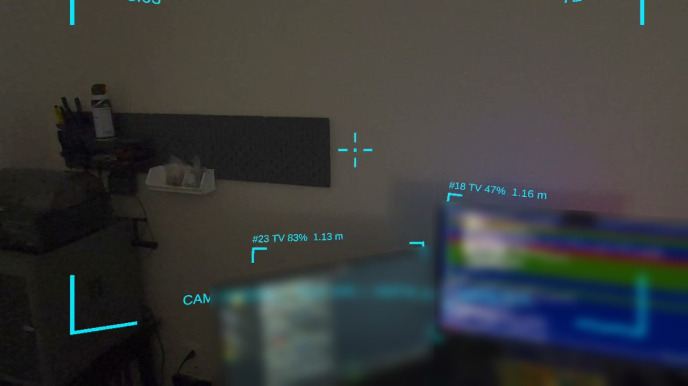

# ironman-quest3-hud

An Iron Man-style mixed-reality HUD for the Meta Quest 3. The app detects objects in the headset's own camera feed and draws world-locked overlays (boxes, labels, distance, target lock) on passthrough. A 3D-printed repulsor prop built around a Touch Plus controller aims and fires VR "blasts" at detected objects. Later, nicklink adds LEDs and sound over BLE.

**Direction:** headset camera first. Unity 6 + Meta XR Core SDK + MRUK, Passthrough Camera API frames, on-device YOLO first, then offload to an RTX 5080 running DeepStream 8 + NvDCF. A room-corner Jetson camera with fused tracks is an optional later phase.



*Repulsor v1 on a Quest 3: lock on a target (red guide line while charging), release to fire a bolt, impact shockwave and sparks, brackets flash `NEUTRALIZED`, hit counter goes up. The "bird" here is a YOLO false positive on a blank wall corner, which made a handy target; the score threshold has since been raised from 0.30 to 0.40.*

## Status

**Phases 0 to 2 run on a Quest 3, and Phase 3's repulsor v1 software works on device** (Oct 7, 2026, Horizon OS v207). The printed palm shell is next. Verified on the headset:
- Passthrough Camera API frames at 1280x960 go through on-device YOLOv9-t (CPU backend) at about 4.5 detections per second while the app holds 72 FPS.
- World-locked brackets with class, confidence and depth-raycast distance (tv, laptop, person, chair, couch, bottle and vase seen; 0.4 to 2.2 m).
- Repulsor v1: hold to charge (whine, glow, rising haptics), release to fire a bolt; impact flash, shockwave, sparks and sound; locked targets react (`NEUTRALIZED`, `HIT xN`).
- Capture-to-overlay latency is about 256 ms (p50) on CPU; inference is the bulk at about 177 ms. Full numbers: [docs/MEASUREMENTS.md](docs/MEASUREMENTS.md).
- Builds headless on Linux with Unity 6000.0.84f1 (see [docs/SETUP.md](docs/SETUP.md)).

Not measured yet: GPU backend, distance accuracy against a tape measure, world-lock drift, track ID stability.

| Repulsor v1 hit | Repulsor v0 beam lock | Two monitors detected with distances |
|---|---|---|
|  |  |  |

*Screen contents and a few personal items are blurred.*

What's in [`unity/IronManHUD`](unity/IronManHUD):
- Passthrough plus a head-locked HUD curved like a visor (70 degrees wide): corner brackets, reticle, clock, FPS, status line.
- Phase 1: Passthrough Camera API frames, then YOLO via Unity Inference Engine (throttled), then CPU NMS.
- Phase 2: world-locked target brackets with label, confidence and distance (MRUK depth raycast, median of 5 rays), with smoothing and ID persistence.
- Latency overlay (preprocess, inference, NMS, grab-to-place and capture age) plus a CSV log on the headset.
- Repulsor v1 (Phase 3): calibrated palm-emitter aim, lock cone, hold-to-charge / release-to-fire bolts, impact flash + shockwave + sparks, procedural sound (no audio assets), haptics, target hit reactions. Palm-gesture mode for the open-hand prop: aim the palm where you look to charge, thrust to fire. Input goes through `IRepulsorInput` (Touch only for now; nicklink BLE later).
- Fallbacks: no camera permission, no depth or no model still gives a running HUD with an on-screen message.

## Quick start

```bash
./tools/get-model.sh        # downloads Meta's 2.3 MB YOLOv9-t model into the Unity project (git-ignored)
```
1. Open `unity/IronManHUD` in Unity **6000.0.84f1** (with Android Build Support).
2. Switch the platform to Android. Under XR Plug-in Management > OpenXR (Android tab), enable the Meta XR feature group.
3. Choose **IronManHUD > Create Demo Scene** first (it also sets Meta's project config so `HEADSET_CAMERA` survives), then Meta > Tools > Project Setup Tool > Fix All.
4. **Build And Run** to a Quest 3 (Horizon OS v74+) in developer mode.
5. Allow the camera and spatial-data prompts in the headset.

Full steps: [docs/SETUP.md](docs/SETUP.md). Test plan: [docs/TEST-TONIGHT.md](docs/TEST-TONIGHT.md).

Controls: **right trigger** hold to charge, release to fire; **B** trigger / palm-gesture mode; **right stick click** aligns the emitter with your view (hold to reset); **X** timing overlay; **Y** CPU / GPU inference.

## Docs
- [docs/SETUP.md](docs/SETUP.md): install, pinned versions, build and run, troubleshooting
- [docs/TEST-TONIGHT.md](docs/TEST-TONIGHT.md): first on-device test checklist and numbers to record
- [docs/MEASUREMENTS.md](docs/MEASUREMENTS.md): on-device timing and observations
- [docs/PLAN.md](docs/PLAN.md): phased plan, architecture, risks
- [docs/RESEARCH.md](docs/RESEARCH.md): research brief (as of Oct 6, 2026)

## Related repos
- [deepstream-house-tracker](https://github.com/NickStassen/deepstream-house-tracker): DeepStream detection + NvDCF tracking + JSON events
- [nicklink](https://github.com/NickStassen/nicklink): STM32F103 board with an LSM6DSV IMU
- [jetson-nano-ov5647](https://github.com/NickStassen/jetson-nano-ov5647): OV5647 CSI camera driver for Jetson Nano

## Credits
Camera, inference and depth-raycast patterns follow Meta's [Unity-PassthroughCameraApiSamples](https://github.com/oculus-samples/Unity-PassthroughCameraApiSamples) (MIT).
