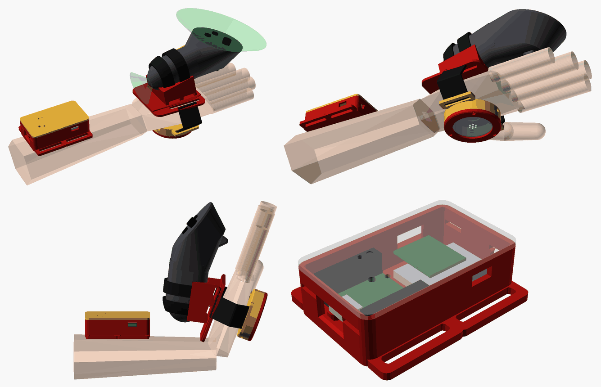

# Repulsor prop v0 (palm emitter, open hand)

A parametric OpenSCAD shell that turns a Meta Quest 3 **Touch Plus** controller into an Iron Man-style palm repulsor, printed in **PETG** on a Bambu Lab P2S. This is Phase 3 of [docs/PLAN.md](../../docs/PLAN.md), with room reserved for the Phase 4 [nicklink](https://github.com/NickStassen/nicklink) electronics.

*Top: back of the hand (green cones are the IR LED keep-out zones) and the palm side. Bottom: the wrist bent back 70 degrees with the controller swinging clear of the forearm pod, and the pod with the lid ghosted (nicklink on the left, LiPo and BLE board on the right). The hand, controller and boards are simplified stand-ins.*

**Status: v0, not test-fitted.** Every part renders without errors (manifold and CGAL), and the STLs are closed 2-manifolds. The Touch Plus geometry comes from a community 3D scan, not a physical controller. Expect one or two print iterations.

## How it works

- **Cradle (back of the hand).** The right Touch Plus lies along the back of the hand, trigger side down and **faceplate facing away from the hand**. Its nose points toward the fingers and is tilted 12 degrees nose-up. In the Iron Man pose (palm toward the target, fingers up) the faceplate then faces back toward the headset, tilted 20 degrees toward the fingertips, which is roughly the direction of the user's eyes. A saddle holds the lower handle. Two 13 mm hook-and-loop ties go around the handle through tunnels under it.
- **Palm disc (palm).** A 54 mm emitter disc with a diffuser, a bezel and room for an LED ring, a speaker and a side button. It hangs on the palm band.
- **Palm band.** One 25 mm hook-and-loop strap per side joins the cradle to the palm disc around the edges of the hand. The radial (thumb-side) strap passes through the web between the thumb and index finger.
- **Wrist pod (forearm).** The nicklink bay, plus an optional nRF52840 board and a LiPo. It sits on the back of the forearm on two 25 mm straps, 70 mm behind the wrist crease (see [Electronics bay](#electronics-bay-nicklink) for why).

The Unity app has a runtime calibration for the controller-to-emitter transform, so the CAD does not set the exact aim. The [nominal transform](#nominal-controller-to-emitter-transform) is listed below as a starting value.

## Fit range and adjustment (no measuring)

The printed parts are one size. They fit adult hands from roughly the **5th-percentile female to the 95th-percentile male**. The values below were computed from the public ANSUR II data (2012 US Army anthropometric survey: 1,986 women and 4,082 men).

| Dimension | 5th %ile female | Midpoint (preview default) | 95th %ile male | Source |
|---|---|---|---|---|
| Hand breadth across the knuckles | 72 mm | 84 mm | 96 mm | ANSUR II `handbreadth` |
| Hand circumference at the knuckles | 173 mm | 201 mm | 230 mm | ANSUR II `handcircumference` |
| Palm length (wrist crease to middle-finger crease) | 100 mm | 113 mm | 127 mm | ANSUR II `palmlength` |
| Wrist circumference | 142 mm | 166 mm | 191 mm | ANSUR II `wristcircumference` |
| Hand thickness at the palm | 25 mm | 29 mm | 34 mm | Derived* |
| Wrist crease to knuckle line (back of hand) | 80 mm | 93 mm | 107 mm | Derived* |
| Wrist crease to palm-disc centre | 45 mm | 51 mm | 57 mm | Derived* |

\*ANSUR II has no hand thickness. Thickness is estimated from breadth and circumference with a stadium-shaped cross-section, t = (C - 2w) / (pi - 2). That gives 25 to 33 mm, consistent with the 1.0 to 1.4 in (25 to 36 mm) range for hand thickness at metacarpal III in the DoD Anthropometric Guidelines. The knuckle line is taken as about 20 mm short of the finger-base crease. The palm-disc centre is taken as 0.45 x palm length. These three rows are engineering estimates, not survey values.

How the design covers that range:

| Variable | Mechanism |
|---|---|
| Hand breadth and circumference, thickness | Hook-and-loop straps. Nothing rigid spans the thickness of the hand, so thickness only changes strap length. The plate's outer wings are 2.6 mm PETG and flex down onto narrow hands. The palm-disc lugs are 3 mm and flex with the strap angle. |
| Palm length (where the disc sits) | **Sliding, indexed palm band.** Each side of the cradle has a 41 mm long slot running parallel to the plate edge. The band strap can sit anywhere from X = 44 to 58 mm (the band centre, measured from the wrist crease), which covers palm centres of 45 to 57 mm. Ridges every 4 mm on top of the bar the strap wraps around catch the folded strap and act as indexed positions. Count ridges to set both sides alike. |
| Back-of-hand length | The plate ends at 77 mm, 3 mm short of the smallest knuckle line, so it never reaches the knuckles. The controller head overhangs the fingers on all hands. The trigger sits 14 mm above the skin, at X = 116 mm, beyond the largest knuckle line (107 mm). |
| Forearm and wrist size | Two 25 mm straps on the pod. Plain webbing works too, with the printed `strap_adjuster` (tri-glide). |

Strap lengths (printed by the model as `CHECK palm band side strap`): each palm-band side strap needs about 31 mm of path on a small hand and 59 mm on a large one, plus two fold-backs. **Cut each side strap to about 160 mm** and you can cover the whole range by changing the overlap.

## Touch Plus geometry (scan-derived, no measuring)

Design values come from a community 3D scan of a right Touch Plus ([Printables 651296](https://www.printables.com/model/651296-meta-quest-3-right-controller-3d-scan), CC BY-NC; measurements only, the scan is not redistributed here). The scan was aligned to a handle frame and sliced numerically:

| Value | Design value | How it was found |
|---|---|---|
| Overall length, handle bottom to nose | 126 mm | scan |
| Handle width x depth at its widest | 31.5 x 42.2 mm | scan cross-sections |
| Handle cross-section | superellipse, n = 2.5, centre drifting by up to 2.6 mm near the bottom end | fitted to the scan's front half |
| Rounded bottom end | 28 mm long | fitted |
| Grip button | starts about 50 mm up the handle, on the +Y side | scan |
| Trigger tip | 92 mm up, 37 mm in front of the handle axis | scan |
| Faceplate | about 64 mm across, normal 58 degrees from the handle axis | scan |
| Scan volume | 138 cm3 (sanity check against the published 126 g with battery) | scan |

Small errors don't matter much:
- The saddle has a **1.5 mm radial gap** for 1 to 1.5 mm adhesive felt, foam tape or TPU. The modelled envelope stays within +1.5 mm of the scanned handle front everywhere the saddle touches, and a boolean check of the saddle against the scan finds no intersection.
- The saddle stops 2 mm short of the grip button, and the two ties stay below it. The trigger hangs free beyond the saddle.
- For a visual check, download the scan and set `scan_file` to its path; the assembly then shows the real shape instead of the dummy.

A sturdier option for a later version: several community grips replace the **battery cover** with a printed one that carries strap loops ([629910](https://www.printables.com/model/629910-meta-quest-3-controller-grips-sports-active-strap-mod), [627120](https://www.printables.com/model/627120-meta-quest-3-controller-grips-straps), [MakerWorld 1437780](https://makerworld.com/en/models/1437780-quest-3-controller-mount)). That is more rigid than a strapped saddle, but the cover latch is fiddly to get right without the real part.

## Tracking keep-out

Sourced:
- Touch Plus has **no tracking ring**. Meta moved the IR LEDs into the **faceplate** and added **one IR LED at the bottom of the handle** ([Road to VR](https://roadtovr.com/quest-3-touch-plus-tracking-coverage/)).
- Quest 3 continuously runs hand tracking and **fuses it with the controller LED tracking and the controller IMU**. That fusion covers the frequent occlusion of face-mounted LEDs ([UploadVR](https://www.uploadvr.com/meta-explains-quest-3-controller-tracking/)).

Assumed (not from Meta):
- Keep-out cones of 60 degrees half-angle off the whole faceplate and 45 degrees off the handle bottom (the green cones in the preview). A boolean check shows that the cradle, the straps and the palm disc stay out of both.
- Nothing touches the head of the controller. Every part of the cradle and its straps sits below the faceplate plane.

Risks to test (Phase 3 acceptance in PLAN.md already compares tracking loss in the shell against a bare controller):
- The controller is **not held**, and the hand next to it is open. If the system's hand-tracking fusion expects a hand gripping the controller, the fused pose may jump. Test controller tracking with the hand in the Iron Man pose, at 1 m and 3 m.
- In the Iron Man pose the bottom LED points down toward the forearm, so expect it to contribute little.

## Electronics bay (nicklink)

**Location: forearm pod, hand end 70 mm behind the wrist crease.** Why not on the back of the hand:
- The back of the hand is fully taken by the controller and its saddle. The handle's bottom end sits 18 mm past the wrist crease.
- The Iron Man pose bends the wrist back 60 to 75 degrees. That swings the controller's handle end back over the forearm, to about 40 mm behind the crease and 10 to 25 mm above the skin. A box near the wrist on either side of the crease is hit. Boolean checks with the scanned controller found:

| Pod position (hand end behind the crease) | Clashes with the controller |
|---|---|
| 50 mm | at 70 degrees on large hands, and at 80 degrees on all hand sizes |
| 60 mm | at 80 degrees on large hands |
| **70 mm (default)** | **no clash up to 80 degrees, for small, mid and large hands** |

- Mass on the forearm moves less with the hand than mass on the hand. The pod is about 24 g printed.
- The trade-off: nicklink's IMU then measures the **forearm**, not the hand. The controller already gives the hand pose. If a hand-rigid IMU is needed later, see [Open questions](#open-questions-for-the-user).

**Board placement** (pod frame; all dimensions from `nicklink.kicad_pcb` v1.3 and the nicklink README):
- nicklink v1.3: 33.99 x 25.50 x 1.6 mm. It lies **flat, component side up, USB-C edge facing the elbow end wall**, centred across the pod.
- The **USB-C opening** in the elbow end wall is 13 x 7.5 mm with a 1 mm chamfer, sized for a normal plug overmold. Charge and flash in place.
- **Four M2 bosses** match H1 to H4 at (9.93, 2.05), (24.06, 2.05), (9.93, 23.45) and (24.06, 23.45), measured from the USB-edge left corner. Each boss is **4 mm across at the top**, the most nicklink's keep-out allows. With `nl_mount = "insert"` (default), each boss widens below the top into a 5.8 mm base for an **M2 heat-set insert pressed in from under the pod**, through the floor. That keeps the 4 mm top whole. Use M2 x 6 screws. `nl_mount = "selftap"` gives plain 4 mm bosses with 1.7 mm pilots for M2 x 6 self-tapping screws.
- **Mount the board flat and do not over-tighten.** All four boss tops print in the same layer, so they are coplanar. Snug the screws by hand: board flex shows up as accelerometer offset, and H4 is only 2.4 mm from the IMU (per the nicklink README).
- Height budget: 4 mm standoffs (pin stubs need 3 mm under the board), 1.6 mm board, then `header_clear` = **11 mm** above the board top for the two 2x10 headers plus Dupont or JST housings. The lid underside sits 11.4 mm above the board.
- **RESET and BOOT** are tiny top-actuated buttons. The lid has 2.2 mm pin holes above them, so a paperclip works. They are only needed for the USART bootloader (hold BOOT, tap RESET). SWD flashing on J3 needs the lid off anyway. A 3 mm window sits over the status LEDs, and a shallow dot on the lid marks the IMU position.
- **Lid:** four PETG snap tabs (1.2 mm thick, 7 mm long, 0.7 mm catch, about 2 % strain) on the end walls click into windows. Release them by pressing the catches in through the windows.
- **Optional BLE board** (`bay_ble`, default on): a Seeed XIAO nRF52840 (21 x 17.8 mm, BQ25101 LiPo charger, per [Seeed](https://wiki.seeedstudio.com/XIAO_BLE/)) sits on foam tape on top of a 30 x 20 x 5 mm LiPo (for example a 502030) at the hand end. Its USB-C opening is in the thumb-side wall. End stops locate the cell. A slot for a mini slide switch is on the little-finger-side wall.
- **Cable to the palm disc:** 5.5 mm hole in the hand-end wall, little-finger side. Run about 220 mm of 5- or 6-core silicone wire along the little-finger side of the wrist, with about 40 mm of slack for wrist extension. Conductors: LED ring 5 V, GND and DIN; button; speaker.

**nicklink and IMU orientation** (for firmware and Unity alignment). Board axes in the KiCad top view (USB edge at the top): +X_board runs toward J1, +Y_board runs away from the USB edge, and +Z_board comes out of the component side.

| Board axis | HAND frame (right hand, wrist straight) |
|---|---|
| +X_board (toward J1) | +Y, toward the thumb side of the forearm |
| +Y_board (away from USB, KiCad "down") | +X, toward the hand |
| +Z_board (out of the component side) | +Z, out of the back of the forearm |

The LSM6DSV (U4) sits at board (24.2, 17.71) with pin 1 top-left and 0 degrees rotation. In the default assembly that puts it at about HAND (-116, +7, +13) mm. Its sensing axes relative to pin 1 are defined in ST's LSM6DSV datasheet ("pin connections" figure), which could not be retrieved while writing this, so check before relying on it. With the pod flat and lid up, the accelerometer reads about +1 g on the axis that points up. Then raise the hand end: the axis that gains +g points toward the hand. Because the pod is on the forearm, the IMU-to-controller transform changes with wrist angle.

Power note for Phase 4: nicklink's 5V pin (J1.1) wants 4.5 to 5.5 V, and its 3V3 pins must not be back-fed (nicklink README). So a 1-cell LiPo cannot feed it directly. Either add a small 5 V boost board (8 mm strips are free beside the LiPo) or power nicklink over USB-C. A small audio amplifier for the speaker can share that space.

## Palm disc (Phase 4 space)

- **LED ring:** pocket and ribs for a 36.8 mm OD / 23.3 mm ID ring (Adafruit NeoPixel Ring 12, [dimensions](https://forum.digikey.com/t/adafruit-industries-llc-1643-dimensions/28698)). `ring_od`, `ring_id` and `ring_t` take other rings.
- **Diffuser:** 1.6 mm, printed in natural or translucent PETG, with a small speaker grille in the middle. It is clamped by the bezel (3 x M2 x 6 self-tapping screws).
- **Speaker:** locating ring for a 15 mm micro speaker under the ring's centre hole.
- **Button:** 3.5 mm hole in the side wall facing the fingers, for a side-push tactile switch that curled fingertips can press. This is optional; the app's palm-gesture mode needs no button.
- **Cable exit:** 5.1 mm hole toward the wrist on the little-finger side.
- Free height under the ring is 5 mm (`disc_cavity_h`). Total disc height is 15.3 mm.

## Parts and print settings (PETG on a Bambu Lab P2S)

The P2S build volume is 256 x 256 x 256 mm ([Bambu Lab wiki](https://wiki.bambulab.com/en/p2s/manual/p2s-faq)). Every part fits easily, and all of them can share one plate. Each STL in `stl/` is already in print orientation and needs **no supports**.

| Part | Material | Approx. mass | Notes |
|---|---|---|---|
| `cradle` | PETG | 26 g | Plate down. 4 walls, 30 % gyroid, 5 top/bottom layers. The strap tunnels are 15.4 mm bridges. |
| `palm_disc` | PETG | 15 g | Palm side down. 3 walls, 25 % infill. |
| `palm_bezel` | PETG | 4 g | Face down. |
| `diffuser` | natural/translucent PETG | 3 g | Flat, 100 % infill, aligned rectilinear. |
| `wrist_pod` | PETG | 16 g | Floor down. 3 walls. The USB openings and snap windows are short bridges. |
| `wrist_pod_lid` | PETG | 8 g | Outer face down, snap tabs up. Print the tabs solid (3 perimeters). |
| `strap_adjuster` | PETG | 1.4 g | Optional tri-glide for webbing. 100 % infill. |
| `liner` | TPU 95A (optional) | 6 g | Pad under the cradle, with matching band slots. 2 walls, 15 % infill. Or use 3 mm EVA foam. |

Masses are estimates from the solid volumes. With the 126 g controller, the hand carries about 190 g (cradle, disc set, liner, palm straps and controller). The forearm carries about 24 g plus electronics.

PETG settings (start from the Bambu "PETG HF" or "PETG Basic" system profile):
- **Nozzle 240 to 250 C** (Bambu lists 230 to 260 C for PETG HF), 0.4 mm nozzle, **0.2 mm layers** (0.16 mm for the disc, bezel and lid if you want crisper snaps).
- **Bed 70 C** on the Textured PEI plate (Bambu lists 65 to 75 C). On the smooth PEI plate, use glue stick as a release layer, because PETG can bond hard enough to tear the PEI.
- **Cooling:** part fan 30 to 50 %, 100 % for bridges and overhangs. Keep the door closed. The P2S needs no chamber heat for PETG.
- **Stringing:** dry the filament first (Bambu: 65 C for 8 h, store below 20 % RH). Keep the profile's retraction, and turn on "avoid crossing walls". The pod and disc have many openings, so expect some wisps; clean them with a heat gun pass or a knife.
- **First layer:** elephant-foot compensation 0.15 mm, so the slots and lid fit.
- **PETG clearances used in the model:** strap slots +1.2 mm over the strap width; saddle gap 1.5 mm; lid lip 0.25 mm per side; M2 self-tap pilots 1.7 mm; M2 clearance 2.4 mm; M2 heat-set insert holes 3.2 mm. Check the insert maker's hole size, and set the inserts at about 220 to 230 C.
- PETG suits this prop: it is tougher and more flexible than PLA (good for the flexing wings, lugs and snap tabs) and creeps less under constant strap tension.

## Hardware

- Palm band: **2 x 25 mm one-wrap hook-and-loop straps**, about 160 mm each (20 mm also fits the slots).
- Controller: **2 x 13 mm (half-inch) hook-and-loop ties**, about 200 mm each.
- Forearm pod: **2 x 25 mm hook-and-loop straps**, about 300 mm each (forearm sizes vary widely).
- 1 to 1.5 mm adhesive felt or foam tape for the saddle. 3 mm EVA foam or the printed TPU liner under the cradle and pod.
- 3 x M2 x 6 self-tapping screws (bezel).
- Phase 4: 4 x M2 heat-set inserts (or self-tapping screws) and 4 x M2 x 6 screws for nicklink; nicklink v1.3; Seeed XIAO nRF52840; 502030 LiPo; NeoPixel Ring 12; 15 mm micro speaker plus amplifier; side-push tactile switch; mini slide switch; silicone wire.

## Assembly

1. Print the parts. Peel any PETG strings out of the slots.
2. Line the saddle with felt or foam tape. Optionally glue the TPU liner or EVA foam under the cradle and the pod.
3. Thread one 13 mm tie through each saddle tunnel. Lay the controller in the saddle, trigger side down, nose toward the fingers, faceplate up. Wrap the ties over the handle and close them. Keep them off the grip button and the faceplate.
4. Screw the bezel over the diffuser onto the palm disc (Phase 4 parts inside first).
5. Loop each palm-band strap through a disc lug and fold it back on itself.
6. Put the cradle on the back of the hand. Bring the radial strap up through the thumb web and the ulnar strap around the little-finger side. Thread each through its cradle slot from below, over the bar, and fold it back. Slide both straps along the slots until the disc sits in the palm hollow. Count ridges so both sides match, then tighten.
7. Strap the pod to the back of the forearm, hand end about 70 mm behind the wrist crease. Route the cable along the little-finger side with slack.
8. In the app, run the controller-to-emitter calibration.

## Nominal controller-to-emitter transform

The emitter is the centre of the diffuser front face, and the aim direction is the palm normal. The model prints these lines as `NOMINAL ...`, for the small, mid and large preview hands with the default parameters.

**In the HANDLE frame** (exact for the CAD; mm). Origin is the bottom end of the handle, on its axis. +X runs up the handle, +Z toward the faceplate side, +Y = Z x X.

| Hand | Emitter position | Aim direction |
|---|---|---|
| small | (12.0, 0, -73.4) | (-0.208, 0, -0.978) |
| mid | (17.0, 0, -78.6) | same |
| large | (21.9, 0, -84.7) | same |

**In Unity** (estimates, about +/-20 mm and +/-10 degrees). The scan has no pose origin, so the conversion assumes the following:
- **OpenXR grip pose:** origin on the handle axis 45 mm up from the bottom end (`oxr_grip_x`, a guess). Axes follow the OpenXR spec: -Z runs along the handle from little finger to thumb, and +X goes into the palm for the right hand. Unity flips Z.
- **Legacy OVR pose:** the grip pose offset by (-1, -20, 48) mm and then rotated 60 degrees about X. These are the Quest 3 right-controller values in SenseGlove's Unity SDK (`SG_HandTracking.cs`), which converts between the two.

| Hand | OVR legacy anchor: localPosition (m) | OpenXR grip: localPosition (m) |
|---|---|---|
| small | (0.001, -0.097, 0.006) | (0.000, -0.073, -0.033) |
| mid | (0.001, -0.095, 0.013) | (0.000, -0.079, -0.028) |
| large | (0.001, -0.094, 0.020) | (0.000, -0.085, -0.023) |
| aim | dir (0, -0.669, 0.743) = localEulerAngles (42, 0, 0) | dir (0, -0.978, -0.208) = localEulerAngles (102, 0, 0) |

As a calibration default, use the mid-hand OVR row, since `OVRCameraRig.rightControllerAnchor` is assumed to report the legacy pose: emitter about 9.5 cm below the anchor along its -Y, beam pitched 42 degrees down from the anchor's forward. The current `RepulsorController` fires along the anchor's forward with a 5 cm offset, so on the hand it would point about 42 degrees off the palm normal until calibrated.

## Changing the design

- Open `repulsor.scad` in OpenSCAD and use the Customizer. `preview_hand` (small, mid or large) and `preview_wrist_ext` only change the preview. The printed parts are the same for all hands.
- Export a part: `openscad -D 'part="cradle"' --export-format binstl -o stl/cradle.stl repulsor.scad` (likewise `palm_disc`, `palm_bezel`, `diffuser`, `wrist_pod`, `wrist_pod_lid`, `strap_adjuster`, `liner`).
- The console prints `CHECK` lines (faceplate tilt, trigger clearance, plate end vs knuckles, band travel vs palm centres, tunnel roofs, strap lengths) and warnings if a change breaks one.
- Useful parameters:
  - `ctrl_pitch` and `ctrl_lift`: faceplate tilt vs height.
  - `ctrl_roll`: rolls the faceplate toward the thumb, to face the headset more directly.
  - `band_x`: palm band travel.
  - `strap_w`: hand strap width.
  - `fit_gap`: liner thickness.
  - `header_clear`, `nl_mount`, `bay_ble`, `lipo`: the bay.
  - `pod_gap`: pod position.
  - `hand = "left"`: mirror everything. Untested.
- Tested with the OpenSCAD 2026.10 nightly (`--backend=manifold`, and the CGAL backend for every part).

## Open questions for the user

1. **IMU on the forearm vs the hand.** The bay is on the forearm (see the sweep table). If Phase 4 needs a hand-rigid IMU (for example thrust detection from nicklink rather than from the controller), options are a second small IMU in the palm disc, or nicklink on the cradle at the cost of about 20 mm more height.
2. **Power for nicklink from a LiPo:** add a 5 V boost board, or power it over USB-C (see the power note above).
3. **Palm button or gesture only:** the side-button hole is there either way.
4. **Hand-tracking fusion** with an open hand next to a strapped controller is unverified. Test it before investing in Phase 4.
5. **Strap sourcing:** ready-made one-wrap hook-and-loop straps, or webbing with the printed tri-glide.

## Sources

- Touch Plus LED layout: [Road to VR](https://roadtovr.com/quest-3-touch-plus-tracking-coverage/). Tracking fusion: [UploadVR](https://www.uploadvr.com/meta-explains-quest-3-controller-tracking/). Weight about 126 g with battery: [docs/RESEARCH.md](../../docs/RESEARCH.md); about 130 g per [Printables 1430084](https://www.printables.com/model/1430084-vr-tennis-controller-adapter-for-the-meta-quest-3).
- Controller scan used for dimensions: [Printables 651296](https://www.printables.com/model/651296-meta-quest-3-right-controller-3d-scan) (CC BY-NC).
- Existing mounts and strap ideas:
  - Velcro strap mod, PETG recommended: [Printables 629910](https://www.printables.com/model/629910-meta-quest-3-controller-grips-sports-active-strap-mod).
  - Battery-cover loops: [627120](https://www.printables.com/model/627120-meta-quest-3-controller-grips-straps).
  - Knuckle strap with elastic cord and textile padding: [667223](https://www.printables.com/model/667223-meta-quest-3-knuckles-controller-grip-strap).
  - Battery-cover mount: [MakerWorld 1437780](https://makerworld.com/en/models/1437780-quest-3-controller-mount).
  - Commercial Quest 3 controllers mounted on the back of the hand: [SenseGlove Nova 2 mount](https://www.mybotshop.de/SenseGlove-Nova-2-Mount-Meta-quest-3-controller_1) and [MANUS Quest 3 adapter](https://www.mybotshop.de/MANUS-adapter-for-Quest-3).
  - Meta's [Touch Accessory Guidelines](https://developers.meta.com/horizon/downloads/package/touch-accessory-guidelines/) (2019, original Touch only).
- Pose conventions: [OpenXR specification, standard pose identifiers](https://registry.khronos.org/OpenXR/specs/1.0/html/xrspec.html#semantic-path-standard-pose-identifiers); [SenseGlove Unity SDK](https://github.com/Adjuvo/SenseGlove-Unity) (`SG_HandTracking.cs`, Quest 3 OpenXR compensation).
- Anthropometry:
  - ANSUR II public data from [Penn State OPEN Lab](https://www.openlab.psu.edu/ansur2/), with the CSVs read from the [US-Army-ANSUR-II mirror](https://github.com/senihberkay/US-Army-ANSUR-II). Percentiles were computed for this README.
  - Hand thickness: [DoD Anthropometric Guidelines](https://www.denix.osd.mil/ergo-wg/denix-files/sites/58/2016/04/AnthropometricGuidelines.doc).
- Printer and material: [Bambu Lab P2S FAQ](https://wiki.bambulab.com/en/p2s/manual/p2s-faq) (256 mm cube build volume); [Bambu Lab PETG HF](https://eu.store.bambulab.com/en-ro/products/petg-hf) (230 to 260 C nozzle, 65 to 75 C bed, dry at 65 C for 8 h).
- Electronics:
  - [nicklink](https://github.com/NickStassen/nicklink) README and `nicklink.kicad_pcb` v1.3 (outline, holes, USB-C, buttons, IMU, J1.1 input range, mounting note).
  - [Seeed XIAO nRF52840](https://wiki.seeedstudio.com/XIAO_BLE/).
  - [Adafruit NeoPixel Ring 12 dimensions](https://forum.digikey.com/t/adafruit-industries-llc-1643-dimensions/28698).
