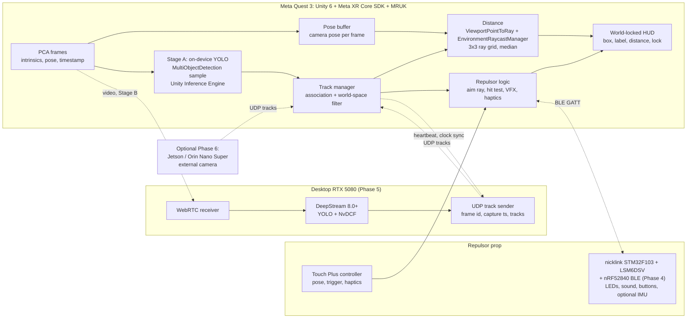

# Project plan: Iron Man HUD on Meta Quest 3

_Plan written Oct 6, 2026. Facts, versions and figures come from [RESEARCH.md](RESEARCH.md) (web research as of Oct 6, 2026). Effort and calendar numbers are estimates. Latency, FPS and accuracy numbers are things to measure, not known values._

## Goal

A mixed-reality HUD on a Meta Quest 3 that detects everyday objects and draws world-locked overlays (box, label, distance, target lock) on passthrough. A 3D-printed repulsor prop aims at a detected object and fires a VR "blast" at it.

Hobby project, evenings and weekends. Kept separate from day-job work.

### Demo definition

**v1 done** (Phases 0 to 3, all on the headset, no PC):
- A sideloaded Quest 3 app runs in a normal room with passthrough.
- At least 3 COCO object types (for example chair, cup, laptop) get a box, a label and a distance in metres.
- Overlays stay on their objects while the head turns, because they are world-locked.
- Holding the repulsor prop, aiming at an object shows a target lock. Pulling the trigger fires a blast with VFX, sound and haptics, and the hit object reacts.
- The latency, FPS and distance-error numbers from the harness are written down in `docs/MEASUREMENTS.md`.
- A 1 to 2 minute demo video is recorded.

**v1.1:** the prop has its own LEDs, sound and buttons over BLE (Phase 4).

**v2 (target architecture, Direction B):** detection and NvDCF tracking run on the RTX 5080, tracks stream back to the headset, and the app falls back to on-device detection when the link drops (Phase 5).

**Optional:** external head-mounted camera (Phase 6) and polish (Phase 7).

## Architecture

Direction B from the research: the Quest's own Passthrough Camera API (PCA) is the camera. Detection starts on-device (Stage A) and moves to the desktop (Stage B). The Jetson is an optional later phase (Direction C), only for a wider FOV or a sensor PCA can't provide.

Why: PCA gives RGB frames with intrinsics, a world-space camera pose and a timestamp per frame. That removes external-camera calibration and Jetson-to-Quest clock sync, which were the hardest parts of the original plan.



Key design rules:
- **Use the camera pose at capture time**, not the current head pose, when turning a box into a ray. Keep a ring buffer of PCA poses keyed by frame timestamp.
- **Draw in world space** so head motion since capture cancels out.
- **Echo the frame id and Quest capture timestamp** in every desktop track packet, so the Quest can look up its own stored pose. Clock sync is then needed mainly for latency stats and keep-alive. (Engineering suggestion, not from Meta docs.)
- **Measure before polish.** On-device YOLO FPS, offload round trip and depth accuracy are all unpublished.

## Phases

Effort units: **E** = a weeknight evening (about 2 to 3 h), **W** = a weekend day (about 5 to 6 h). All effort figures are estimates for someone new to Unity and Quest.

### Phase 0: Quest dev setup

Deliverables:
- Developer mode on the Quest 3; headset updated.
- Unity 6 (6000.0.38f1 or newer, required by the SDK) with Android build support, Meta XR Core SDK and MRUK. Unity OpenXR, not the deprecated Oculus XR Plugin.
- `unity/` project with the Passthrough Building Block and a world-locked test cube, built as an APK and sideloaded.
- `docs/SETUP.md`: headset Horizon OS version, Unity version, Meta XR SDK version, build steps.

Acceptance:
- Hello-passthrough APK installs over adb and runs; the cube stays fixed in the room while walking around.
- Horizon OS version recorded and is v74 or newer (v76+ for Camera2, v83+ for 1280x1280 PCA).
- Optional: PCA preview working in the Unity Editor over Meta Horizon Link v2.1+.

Effort: 2 to 4 E + 1 W.

Watch out: Meta SDK version numbers jumped (a community repo pins 205.0.0), so older v7x/v8x tutorials won't match.

### Phase 1: Meta PCA/YOLO sample on-device + latency harness

Deliverables:
- [oculus-samples/Unity-PassthroughCameraApiSamples](https://github.com/oculus-samples/Unity-PassthroughCameraApiSamples) MultiObjectDetection (YOLOv9t uint8, about 2.3 MB, 80 COCO classes) built and running on the headset.
- `tools/latency/`: an in-app timing logger plus a desktop script that pulls the CSV over adb and prints stats. Per detection frame it logs:
  - PCA frame `Timestamp`
  - inference start and end
  - time the result is applied to the scene
  - app frame time
- `docs/MEASUREMENTS.md` with the first numbers.

Acceptance (record, don't target yet):
- Median and p95 of inference time per frame.
- Detection rate in Hz and app frame rate while detecting.
- Capture-to-overlay age (result-applied time minus PCA timestamp), median and p95.
- At least 2 configurations compared, for example two PCA resolutions or inference split across frames (Meta recommends layer-by-layer inference, async readback and the smallest model).
- Optional sanity check: film through the lens with a phone slow-motion mode against a known event to cross-check the internal number.

Effort: 3 to 5 E + 1 W.

Note: Unity Inference Engine on Quest uses no NPU or hardware acceleration and runs on the main thread, so watch for frame drops.

### Phase 2: HUD v1 (world-locked boxes, labels, distance)

Deliverables:
- Box to world: for each detection, cast a 3x3 grid of rays inside the box with `PassthroughCameraAccess.ViewportPointToRay(uv)` using the capture-time pose, raycast each with MRUK `EnvironmentRaycastManager.Raycast`, and take the median hit distance. Distance = |hit - head|.
- Handle `HitPointOutsideOfCameraFrustum` and `NoHit`: show `--` instead of a number.
- World-locked overlay per track: box sized by projecting the box corners at the median depth, class label, confidence, distance.
- Simple track manager: associate detections across frames (IoU or 3D nearest neighbour) and smooth world positions with a small Kalman filter per track.
- `com.oculus.permission.USE_SCENE` permission set. From MRUK v81, no Depth API component is needed.

Acceptance:
- Distance vs tape measure for 3 objects at 0.5, 1, 2 and 3 m: record mean absolute error and the miss rate (no hit). Meta publishes no accuracy figure; usable range is about 0.2 to 5 m.
- Turn the head about 90 degrees and back at normal speed: record how far overlays drift off their objects (cm, estimated by eye against a ruler or from a screen recording).
- Track ID stays the same for a static object over 30 s; record ID switches per minute.
- App frame rate with HUD on vs Phase 1 baseline, recorded.

Effort: 4 to 6 E + 1 to 2 W.

### Phase 3: Repulsor v1 (printed shell + Touch Plus)

Deliverables:
- `cad/repulsor/`: a shell that holds a Touch Plus controller, printed on the Bambu P2S. Leave the controller's IR LED areas uncovered, keep trigger and grip usable, and reserve space for Phase 4 parts (nicklink, nRF52840, LEDs, speaker, battery).
- Unity: aim ray from a palm-emitter offset on the controller pose; target lock when the ray (or a small cone) hits a tracked object's world box; lock reticle and sound.
- Trigger fires a blast: projectile or beam VFX, impact effect on the target, controller haptics.

Acceptance:
- Controller tracking in the shell vs bare controller over a 5-minute session: record tracking-loss events for each.
- Lock acquires on a target at 1 m and 3 m; record lock success over 20 attempts each.
- Prop weight recorded (Touch Plus is about 126 g with battery [wiki snippet]).
- v1 demo (see Demo definition) recorded.

Effort: CAD and printing 2 to 3 E + 1 W (expect 2 to 3 print iterations); Unity 3 to 4 E.

### Phase 4: nicklink BLE add-on (nRF52840)

nicklink has no radio. The research recommends an nRF52840 (BLE 5 with 2 Mbps mode, USB). Avoid HC-05 (Bluetooth Classic, unproven in Unity on Quest).

Deliverables:
- Hardware: nicklink + nRF52840 board + LEDs + small speaker or buzzer + 1 to 2 buttons + battery, wired and fitted in the Phase 3 shell.
- `firmware/nicklink-ble/`:
  - STM32 side: read the LSM6DSV (I2C1 PB6/PB7, addr 0x6A, INT1 on PA0). Use its SFLP fusion to get a game-rotation quaternion from the FIFO (15 to 480 Hz, default 120). Send framed packets to the nRF over UART (UART1 TX is PA9).
  - nRF52840 side: GATT peripheral that bridges UART to BLE and drives LEDs and sound.
  - Alternative to decide early: let the nRF52840 read the IMU directly and drop the STM32.
- `firmware/nicklink-ble/PROTOCOL.md`, a small GATT service, for example:
  - `cmd` (write without response): LED pattern, colour, sound id, charge level.
  - `event` (notify): button down/up with a sequence number.
  - `orient` (notify, optional): quaternion + sample counter.
  - Little-endian binary, 1-byte message type first.
- Unity: BLE via [Velorexe/Unity-Android-Bluetooth-Low-Energy](https://github.com/Velorexe/Unity-Android-Bluetooth-Low-Energy), `connectGatt(..., TRANSPORT_LE)`, sideloaded (Store apps would need the Companion Device API and permission review). Blast charge/fire drives the prop LEDs and sound.

Acceptance:
- Connection interval actually negotiated on Horizon OS recorded (AOSP high priority is 11.25 to 15 ms; unverified on Quest).
- Command-to-LED latency recorded (round-trip echo timestamp, or slow-mo video).
- `orient` notification rate achieved, recorded.
- 30-minute session without disconnect; battery runtime recorded.
- Optional IMU: yaw drift vs controller over 5 minutes recorded (no magnetometer, so yaw drifts; re-align to controller or wrist pose).

Effort: 6 to 10 E + 1 to 2 W.

### Phase 5: Desktop offload to the RTX 5080

Deliverables:
- Desktop runs DeepStream 8.0+ (needed for Blackwell; forum threads say 7.1 doesn't support RTX 50-series) with YOLO and NvDCF. Use [marcoslucianops/DeepStream-Yolo](https://github.com/marcoslucianops/DeepStream-Yolo); DeepStream 8.0+ dropped the bundled YOLOv4-tiny sample.
- Video path: PCA frames over WebRTC (`com.unity.webrtc`, needs a `wss://` signalling server). Start from [danieloquelis/Unity-QuestVisionStream](https://github.com/danieloquelis/Unity-QuestVisionStream) (beta, last push Aug 2025).
- Track path: UDP unicast from desktop to Quest, one packet per processed frame: `frame_id`, Quest capture timestamp, desktop send time, and all active tracks (`id`, class, confidence, normalized bbox). JSON first, FlatBuffers or protobuf later.
- Heartbeat Quest to desktop at 50 to 100 Hz: NTP-style clock offset (keep lowest-round-trip samples) and keep-alive.
- Port from [deepstream-house-tracker](https://github.com/NickStassen/deepstream-house-tracker):
  - Keep the NvDCF config and the pipeline structure (`src/pipeline.c`).
  - `src/events.c` today emits only appeared/lost/summary JSON lines. Add per-frame track output.
  - Replace the `g_get_real_time()` wall-clock `ts` from the OSD probe with the frame's capture timestamp.
  - Normalize bboxes (today they are pixels in the 1280x720 streammux output).
  - Add the UDP unicast sender.
  - Expect API changes from DeepStream 5.1 to 8.0.
- Quest: track receiver, pose lookup by frame id, same raycast and HUD path as Phase 2; automatic fallback to Stage A when no packets arrive for a set timeout.
- Network: dedicated 5/6 GHz SSID, PC wired, AP isolation and PMF off, UDP port open, low-latency Wi-Fi lock held, Energy Efficient Ethernet off if spikes appear.

Acceptance (record and compare with Phase 1):
- Capture-to-overlay age, median and p95.
- Round trip and packet inter-arrival jitter; note any bursting (Quest inbound UDP burstiness is untested; switch tracks to TCP if bursts appear).
- Track ID switches per minute on the same walk-through as Phase 2.
- Fallback to on-device works when the PC is unplugged from the network.

Effort: 2 to 3 W + 6 to 10 E.

### Phase 6 (optional): head-mounted external camera

Only worth it for a wider FOV or a special sensor (thermal, global shutter).

Deliverables:
- Pick the board: Jetson Nano (JetPack 4.6.6 is EOL; DeepStream 6.0.1 ceiling; devkit has no Wi-Fi, needs an M.2 Key E card such as Intel 8265) or Orin Nano Super (about $399 after the July 2026 price hike [snippet]; 22-pin CSI, so the [jetson-nano-ov5647](https://github.com/NickStassen/jetson-nano-ov5647) driver won't carry over).
- Rigid mount on the headset (Quest 3 is 515 g; record added weight).
- ChArUco calibration against the PCA camera: capture the board from both cameras at once, `cv2.stereoCalibrate` or paired `solvePnP`, chain with PCA camera-to-head extrinsics.
- Capture timestamps from Argus `ICaptureMetadata`; clock sync; head pose at capture time via `OVRPlugin.GetNodePoseStateAtTime`.

Acceptance:
- Calibration reprojection error recorded.
- Validation: project the tracked controller position into the external image; record pixel error.
- Capture-to-overlay age recorded and compared with Phases 1 and 5.

Effort: 3 to 4 W + several E.

### Phase 7: Polish

Deliverables:
- JARVIS-style UI: lock rings, scan sweep, target info panel (class, distance, track age, speed from the world-space filter). [xSmoking/Hololens_IronMan](https://github.com/xSmoking/Hololens_IronMan) for visual ideas.
- Voice commands (choose a speech option in this phase).
- Sound design; blast impacts on walls using the MRUK scene mesh.

Acceptance:
- 10-minute session with frame rate recorded and no crashes.
- Final demo video.

Effort: open-ended.

### Rough calendar (estimate)

| Window | Capacity | Plan |
|---|---|---|
| Oct 6 to Oct 25 | Some evenings and weekends | Phases 0 and 1 |
| Oct 26 to Nov 15 | Wedding Oct 31; assume little or none | Pause. Optional: print shell test pieces |
| Nov 16 onward | New job; reduced evenings at first | Phases 2 and 3 (v1), then 4, then 5 |

## Repo layout

```
ironman-quest3-hud/
  unity/                 Unity 6 project (Meta XR Core SDK + MRUK)
  desktop/               DeepStream 8 pipeline, WebRTC receiver, UDP track sender, signalling
  firmware/nicklink-ble/ STM32 + nRF52840 firmware, PROTOCOL.md
  cad/                   Repulsor shell (source + STL/3MF), print notes
  tools/latency/         Timing logger parsers, adb pull scripts, plots
  docs/                  PLAN.md, RESEARCH.md, SETUP.md, MEASUREMENTS.md
```

Add a Unity `.gitignore` (Library/, Temp/, Builds/) and Git LFS for large binaries before the first Unity commit.

## Key risks and mitigations

| Risk | Mitigation |
|---|---|
| On-device YOLO FPS and offload latency are unpublished | Phase 1 harness first; decide on Stage B from real numbers |
| Inference on the main thread drops frames | Layer-by-layer inference, async readback, smallest model, lower detection rate than render rate |
| PCA FOV is narrower than passthrough | Show detections only where the camera sees; HUD hint at FOV edge; Phase 6 if it matters |
| Depth is coarse (about 320x320, 0.2 to ~5 m), no accuracy figure | 3x3 median, `--` on no hit, temporal filter per track, measure error in Phase 2 |
| Shell blocks controller IR LEDs | Leave LED areas open; compare tracking loss with bare controller |
| Quest Wi-Fi UDP bursts | Dedicated SSID, low-latency lock, wired PC; TCP fallback |
| WebRTC may not carry per-frame id/timestamp cleanly | Check how QuestVisionStream maps frames; side data channel with frame id if needed |
| SDK version churn, old tutorials | Pin versions in `docs/SETUP.md`; prefer Meta docs and official samples |
| BLE behaviour on Horizon OS unverified | Sideload only; measure interval and latency early in Phase 4 |
| Limited time (wedding, new job) | Small phases, each ending in something that runs; pause cleanly |
| IP hygiene with the new job | Keep it clearly a hobby project on personal hardware and time; check the new employer's side-project policy |
| Jetson Nano EOL and Jetson price hike | Jetson stays optional (Phase 6) |

## Open questions

1. What Horizon OS version is the headset on (v74+, v76+ for Camera2, v83+ for 1280x1280)?
2. Which time base does the PCA `Timestamp` use, and how does it compare with Unity/OVR time? Needed for valid capture-to-overlay numbers.
3. Use the main Touch Plus controller in the prop, or get a spare?
4. nRF52840 as a UART bridge next to the STM32, or nRF52840 alone reading the IMU?
5. Which OS runs on the RTX 5080 desktop, and does it match DeepStream 8.0+ platform support?
6. How does QuestVisionStream keep frame id and capture time through WebRTC?
7. Does inbound UDP to the Quest arrive in bursts (only outbound was reported)?
8. Does gripping the prop hurt controller or hand tracking (no source found)?
9. CAD tool for the shell?
10. Which voice option for Phase 7?

## Week-1 checklist

- [ ] Enable developer mode on the Quest 3; update it; write down the Horizon OS version.
- [ ] Install Unity Hub and Unity 6 (6000.0.38f1 or newer) with Android build support.
- [ ] Install adb; confirm the headset shows up.
- [ ] New Unity project in `unity/`: Meta XR Core SDK + MRUK, project setup fixes applied, Passthrough Building Block, world-locked cube. Build and sideload.
- [ ] Clone Unity-PassthroughCameraApiSamples; build MultiObjectDetection; run it on the headset.
- [ ] Optional: PCA preview in the Editor over Meta Horizon Link v2.1+.
- [ ] Add `.gitignore`, Git LFS and the empty folder skeleton; start `docs/SETUP.md`.
- [ ] Note the first rough impressions (does detection feel live or laggy?) in `docs/MEASUREMENTS.md`.
- [ ] Read the new employer's side-project/IP policy before Nov 16.

## Links

Nick's repos:
- [deepstream-house-tracker](https://github.com/NickStassen/deepstream-house-tracker): DeepStream 5.1 C app, YOLOv4-tiny TensorRT FP16 + NvDCF, per-object JSON events
- [nicklink](https://github.com/NickStassen/nicklink): STM32F103C8 board with an LSM6DSV IMU
- [jetson-nano-ov5647](https://github.com/NickStassen/jetson-nano-ov5647): OV5647 CSI driver for Jetson Nano

Key sources (full list in [RESEARCH.md](RESEARCH.md#sources)):
- PCA overview: https://developers.meta.com/horizon/documentation/unity/unity-pca-overview/
- PCA documentation: https://developers.meta.com/horizon/documentation/unity/unity-pca-documentation/
- PCA with Inference Engine (Sentis): https://developers.meta.com/horizon/documentation/unity/unity-pca-sentis/
- Object detection sample: https://developers.meta.com/horizon/documentation/unity/unity-sample-camera-object-detection/
- Environment raycast (MRUK): https://developers.meta.com/horizon/documentation/unity/unity-mr-utility-kit-environment-raycast/
- `EnvironmentRaycastManager` reference: https://developers.meta.com/horizon/reference/mruk/v85/class_meta_x_r_environment_raycast_manager/
- Depth API: https://developers.meta.com/horizon/documentation/unity/unity-depthapi-overview/
- Official PCA samples: https://github.com/oculus-samples/Unity-PassthroughCameraApiSamples
- QuestCameraKit: https://github.com/xrdevrob/QuestCameraKit
- Unity-QuestVisionStream: https://github.com/danieloquelis/Unity-QuestVisionStream
- DeepStream-Yolo: https://github.com/marcoslucianops/DeepStream-Yolo
- DeepStream 8.0 release notes: https://docs.nvidia.com/metropolis/deepstream/8.0/text/DS_Release_notes.html
- RTX 50-series DeepStream thread: https://forums.developer.nvidia.com/t/does-geforce-rtx50-series-support-deepstream-apps/341282
- Quest UDP batching issue: https://github.com/wengmister/hand-tracking-streamer/issues/4
- Unity BLE plugin: https://github.com/Velorexe/Unity-Android-Bluetooth-Low-Energy
- OpenCV calib3d: https://docs.opencv.org/4.x/d9/d0c/group__calib3d.html
